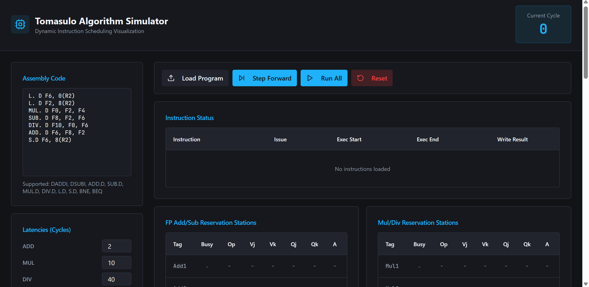
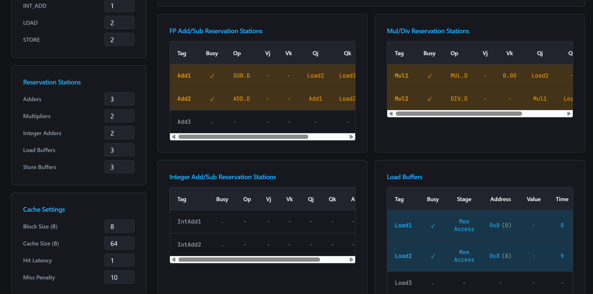
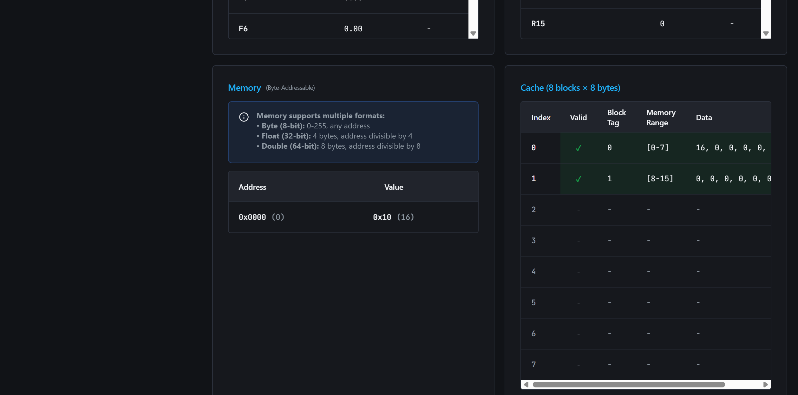
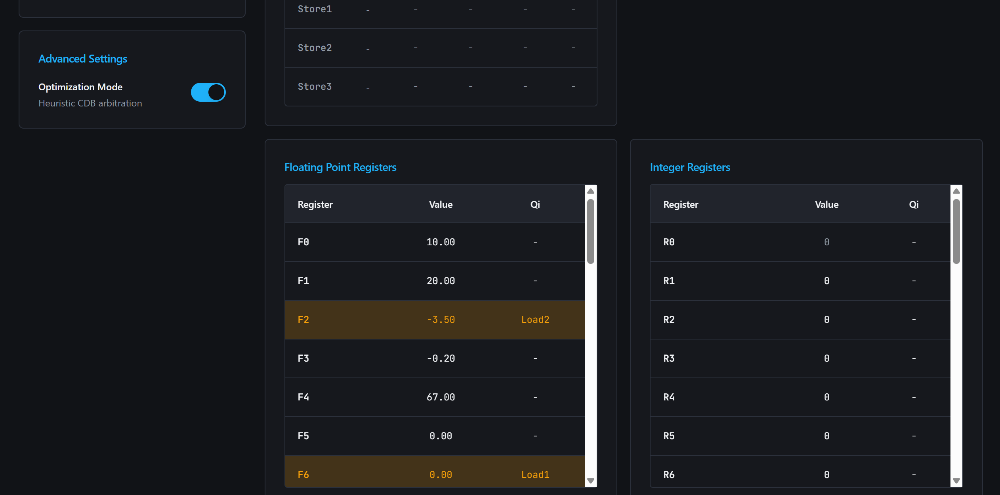

<div align="center">


# 🎯 Tomasulo Tracker

### *A Professional GUI Simulator for the Tomasulo Algorithm*

[](https://reactjs.org/)
[](https://www.typescriptlang.org/)
[](https://vitejs.dev/)
[](https://tailwindcss.com/)

**A robust, interactive React-based simulator that visualizes cycle-by-cycle instruction execution, out-of-order processing, dynamic scheduling, register renaming, and memory hierarchy behaviors in the Tomasulo Algorithm.**

[Features](#-core-features) • [Getting Started](#-getting-started) • [Documentation](#-documentation) • [Tech Stack](#-tech-stack) • [Screenshots](#-screenshots)

</div>

---

## 📋 Table of Contents

- [Overview](#-overview)
- [Core Features](#-core-features)
- [Supported Instructions](#-supported-instructions)
- [Tech Stack](#-tech-stack)
- [Getting Started](#-getting-started)
- [Documentation](#-documentation)
- [Project Structure](#-project-structure)
- [Configuration](#-configuration)
- [Screenshots](#-screenshots)
- [Contributing](#-contributing)

---

## 🔍 Overview

**Tomasulo Tracker** is a comprehensive web-based simulator that brings the Tomasulo Algorithm to life through an intuitive, real-time graphical interface. Originally developed by Robert Tomasulo at IBM in 1967, this algorithm revolutionized out-of-order execution in modern processors.

This simulator provides:
- **Academic Learning Tool**: Perfect for computer architecture courses, enabling students to visualize complex concepts like register renaming, reservation stations, and the Common Data Bus (CDB)
- **Research & Development**: A sandbox for experimenting with instruction scheduling, hazard detection, and cache behavior
- **Interactive Debugging**: Step through instruction execution cycle-by-cycle to understand pipeline behavior and dependencies

Whether you're a student learning about dynamic instruction scheduling or a researcher exploring processor microarchitecture, Tomasulo Tracker offers unparalleled insight into one of computing's most influential algorithms.

---

## ✨ Core Features

### 🎯 Full Tomasulo Algorithm Implementation
- **Register Renaming**: Automatic elimination of false dependencies (WAR, WAW hazards)
- **Out-of-Order Execution**: Instructions execute as soon as operands are available, regardless of program order
- **Dynamic Scheduling**: Reservation stations track dependencies and issue instructions opportunistically
- **Common Data Bus (CDB)**: Broadcast mechanism for result forwarding to waiting instructions

### 🧠 Hardware Component Simulation
- **Reservation Stations**: Separate stations for integer, floating-point addition, multiplication, and division operations
- **Load/Store Buffers**: Dedicated buffers with proper conflict detection and address calculation
- **Register Files**: Integer (R0-R31) and floating-point (F0-F31) registers with status tracking
- **Memory Hierarchy**: Configurable cache with hit/miss simulation, block sizes, and access latencies

### 🛡️ Hazard Detection & Resolution
- **RAW (Read After Write)**: True data dependencies automatically handled via register renaming
- **WAR (Write After Read)**: False dependencies eliminated through reservation station buffering
- **WAW (Write After Write)**: Output dependencies resolved via register renaming
- **Memory Conflicts**: Load/Store operations properly ordered to prevent data races

### 🎮 Interactive Visualization
- **Cycle-by-Cycle Stepping**: Advance execution one cycle at a time to observe state changes
- **Color-Coded Status**: Visual feedback for instruction stages (issued, executing, stalled, completed)
- **Real-Time Updates**: All hardware tables update simultaneously to reflect current architectural state
- **Branch Handling**: Supports BNE/BEQ instructions without branch prediction

### ⚙️ Cache Simulation
- **Configurable Parameters**: Set cache hit/miss latencies, block sizes, and memory access patterns
- **Miss Penalty Modeling**: Realistic simulation of cache miss overhead
- **Block Fetching**: Entire cache blocks loaded on misses, affecting subsequent accesses
- **Hit/Miss Tracking**: Visual indication of cache performance for each memory operation

---

## 📝 Supported Instructions

### Integer Operations
- `DADDI` - Doubleword Add Immediate
- `DSUBI` - Doubleword Subtract Immediate

### Floating-Point Arithmetic
- `ADD.D`, `ADD.S` - Double/Single-precision Addition
- `SUB.D`, `SUB.S` - Double/Single-precision Subtraction  
- `MUL.D`, `MUL.S` - Double/Single-precision Multiplication
- `DIV.D`, `DIV.S` - Double/Single-precision Division

### Memory Operations
- **Load**: `LW`, `LD`, `L.S`, `L.D` (Word, Doubleword, Single, Double)
- **Store**: `SW`, `SD`, `S.S`, `S.D` (Word, Doubleword, Single, Double)

### Control Flow
- `BNE` - Branch if Not Equal
- `BEQ` - Branch if Equal

---

## 🛠️ Tech Stack

Tomasulo Tracker is built with modern web technologies for optimal performance and developer experience:

| Technology | Purpose | Version |
|------------|---------|---------|
| **React** | UI framework with component-based architecture | 18.3.1 |
| **TypeScript** | Type-safe development and enhanced IDE support | 5.8.3 |
| **Vite** | Lightning-fast build tool and dev server | 5.4.19 |
| **Tailwind CSS** | Utility-first CSS framework for rapid styling | 3.4.17 |
| **shadcn/ui** | Accessible, customizable UI components (Radix UI) | Latest |
| **React Router** | Client-side routing for single-page application | 6.30.1 |
| **Lucide React** | Beautiful, consistent icon library | 0.462.0 |

---

## 🚀 Getting Started

### Prerequisites

Ensure you have **Node.js** (v16 or higher) and **npm** installed on your system.

### Installation

1. **Clone the repository**
   ```bash
   git clone https://github.com/yourusername/tomasulo-tracker.git
   cd tomasulo-tracker
   ```

2. **Install dependencies**
   ```bash
   npm install
   ```

3. **Start the development server**
   ```bash
   npm run dev
   ```

4. **Open your browser**
   
   Navigate to `http://localhost:8080` to start simulating!

### Build for Production

```bash
# Create optimized production build
npm run build

# Preview production build locally
npm run preview
```

---

## 📚 Documentation

Comprehensive documentation is available to help you understand the implementation and usage:

- **[Quick Test Examples](./QUICK_TESTS.md)** - Ready-to-use test cases (⭐ start here!)
- **[Execution Flow Diagrams](./EXECUTION_FLOW.md)** - Visual diagrams showing Load/Store execution stages
- **[Load/Store Testing Guide](./LOAD_STORE_TESTING.md)** - Comprehensive testing guide with detailed explanations
- **[Implementation Summary](./IMPLEMENTATION_SUMMARY.md)** - Technical details of the Load/Store implementation

---

## 📂 Project Structure

```
tomasulo-tracker/
├── public/               # Static assets
├── src/
│   ├── components/       # React components
│   │   ├── simulator/    # Simulator-specific UI components
│   │   │   ├── ConfigPanel.tsx
│   │   │   ├── ControlPanel.tsx
│   │   │   ├── InstructionInput.tsx
│   │   │   ├── InstructionStatusTable.tsx
│   │   │   ├── LoadStoreBufferTable.tsx
│   │   │   ├── RegisterFileTable.tsx
│   │   │   ├── ReservationStationTable.tsx
│   │   │   ├── CacheTable.tsx
│   │   │   ├── MemoryTable.tsx
│   │   │   └── MemoryWritesTable.tsx
│   │   └── ui/           # shadcn/ui components
│   ├── lib/
│   │   ├── tomasuloEngine.ts  # Core simulator logic
│   │   └── utils.ts           # Utility functions
│   ├── types/
│   │   └── simulator.ts       # TypeScript type definitions
│   ├── pages/
│   │   ├── Index.tsx          # Main simulator page
│   │   └── NotFound.tsx
│   └── hooks/            # Custom React hooks
├── package.json
├── vite.config.ts
├── tailwind.config.ts
└── tsconfig.json
```

---

## ⚙️ Configuration

The simulator provides extensive configuration options through the **Config Panel**:

### Reservation Stations
- Number of stations for each operation type (integer, FP add, FP multiply, FP divide)
- Execution latencies for each operation category

### Load/Store Buffers
- Number of load buffers
- Number of store buffers
- Memory access latencies

### Cache Settings
- Cache hit latency (cycles)
- Cache miss penalty (additional cycles)
- Cache block size (bytes)
- Initial cache state configuration

### Initial State
- Pre-set register values (integer and floating-point)
- Pre-set memory values at specific addresses

---

## 🖼️ Screenshots

### Main Simulator Interface

*Intuitive control panel for step-by-step execution*

### Reservation Stations View

*Real-time visualization of reservation station status*

### Memory / Cache

*Memory and cache simulation with hit/miss tracking*

### Register File Status

*Register values and qi tags showing dependencies*

---

## 🤝 Contributing

Contributions are welcome! Whether you're fixing bugs, improving documentation, or adding new features:

1. Fork the repository
2. Create a feature branch (`git checkout -b feature/amazing-feature`)
3. Commit your changes (`git commit -m 'Add amazing feature'`)
4. Push to the branch (`git push origin feature/amazing-feature`)
5. Open a Pull Request

---

## 🙏 Acknowledgments

- **Robert Tomasulo** - For the original algorithm design at IBM (1967)
- **shadcn** - For the beautiful UI component library
- **Radix UI** - For accessible, unstyled component primitives
- **The Computer Architecture Community** - For continuous innovation in processor design

---

<div align="center">

**Built with ❤️ for Computer Architecture Education**

[⬆ Back to Top](#-tomasulo-tracker)

</div>
